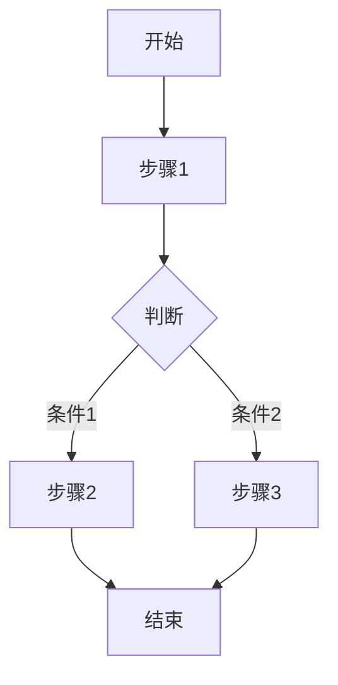
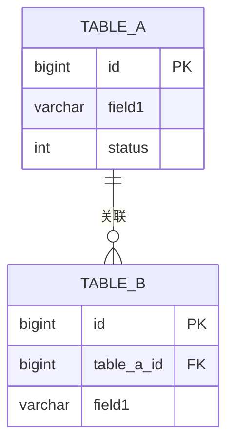

# 领域知识库详细文档生成

本 skill 用于对已识别的末级能力项生成详细的知识库文档，包含代码设计、前后端交互、数据库设计、业务流程等完整信息。

## 适用场景

- 用户要求深入分析某个末级能力项
- 需要生成标准化的知识库详细文档
- 已完成领域能力清单（通过 `/dst-domain-capability-analysis`），需要补充细节

## 前置条件

**必须先执行 `/dst-domain-capability-analysis` 生成能力清单**，确保 `docs/knowledge/index.md` 已存在且包含完整的领域结构。

## 分析对象定义

### 末级概念

**末级** = 能力清单中最细粒度的可分析单元

- 如果子域下有能力项列表，则**能力项是末级**
- 如果子域本身就是最细粒度（没有下级能力项），则**子域是末级**

### 判断规则

```markdown
- **履约进度**：描述...        ← 子域（有下级能力项，不是末级）
  - 发起工单：描述...          ← 能力项（末级，需要分析）
  - 完成工单：描述...          ← 能力项（末级，需要分析）

- **库存明细**：描述...        ← 子域（没有下级能力项，是末级）
  - 无独立编辑能力...          ← 说明文字，不是能力项
```

## 执行模式

### 模式一：批量分析所有末级（默认）

按 `docs/knowledge/index.md` 中的顺序，逐个分析所有末级：

1. 读取能力清单，提取所有末级列表
2. 按顺序分析第一个末级（在收集信息阶段强烈建议通过工具**并行探索**代码，例如同时搜索前/后端入口和常量定义，以提高分析效率和深度）
3. 生成文档后，询问用户是否继续
4. 用户确认后，执行 `/clear` 清空上下文
5. 继续分析下一个末级

### 模式二：分析指定末级

直接指定要分析的末级名称（支持子域名+能力名组合）：

```
/dst-domain-knowledge-detail 履约进度-发起工单
/dst-domain-knowledge-detail 库存明细
```

## 交互流程

```
┌─────────────────────────────────────────────────────┐
│  开始                                                │
└─────────────────────────────────────────────────────┘
                        │
                        ▼
┌─────────────────────────────────────────────────────┐
│  读取 docs/knowledge/index.md，提取末级列表          │
│  （末级 = 能力项 或 无下级的子域）                    │
└─────────────────────────────────────────────────────┘
                        │
                        ▼
┌─────────────────────────────────────────────────────┐
│  分析当前末级，生成详细文档                           │
└─────────────────────────────────────────────────────┘
                        │
                        ▼
┌─────────────────────────────────────────────────────┐
│  更新 index.md：链接添加到末级名称上                  │
└─────────────────────────────────────────────────────┘
                        │
                        ▼
┌─────────────────────────────────────────────────────┐
│  询问用户：是否继续分析下一个末级？                   │
│  [继续] 执行 /clear 后分析下一个                      │
│  [停止] 结束本次分析                                 │
└─────────────────────────────────────────────────────┘
```

### 用户确认话术

每完成一个末级分析后，输出：

```
---

## 末级分析完成

已完成末级「{一级领域} / {子域} / {末级名称}」的详细分析，文档位于 `docs/knowledge/modules/{一级领域}/{末级名称}.md`。

**剩余待分析末级**：{末级列表}

{注：如果在分析过程中发现了疑似缺陷（Defect）的反直觉设计，必须在此处向用户主动提问以确认。例如：“关于反直觉设计中的 XXX，您认为这是历史遗留设计还是当前代码的缺陷？”}

是否继续分析下一个末级？
- 回复 **继续** - 执行 /clear 清空上下文后继续分析
- 回复 **停止** - 结束本次分析
```

## 输出位置

### 目录结构

每个一级领域创建独立目录，文件名直接使用末级能力名称：

```
docs/knowledge/modules/
├── 履约单管理/
│   ├── 发起工单.md
│   ├── 完成工单.md
│   ├── 发起提车.md
│   └── ...
├── 资源计划管理/
│   ├── 新增资源情况.md
│   ├── 删除资源情况.md
│   └── ...
├── 库存配置管理/
│   ├── 新增库位.md
│   ├── 编辑库位.md
│   └── ...
```

### 文件命名规则

| 末级类型 | 文件名 | 示例 |
|---------|--------|------|
| 能力项 | `{能力名称}.md` | `发起工单.md`、`完成工单.md` |
| 末级子域 | `{子域名称}.md` | `库存明细.md` |

### 路径格式

- 能力项路径：`modules/{一级领域}/{能力名称}.md`
- 末级子域路径：`modules/{一级领域}/{子域名称}.md`

## 文档模板

```markdown
# {末级名称}

## 概述

{末级的简要描述，说明职责边界和核心功能}

## 入口

| 类型 | 标识 | 实现类 |
|------|------|--------|
| HTTP | `GET /xxx/xxx` | `XxxController` |
| HTTP | `POST /xxx/xxx` | `XxxController` |
  | MQ | `{queue_name}` | `XxxConsumer` |
| Job | `{job_name}` | `XxxJob` |
| Frontend | `/path/to/page` | `ComponentPath` |

## 业务常量

### {枚举名称1} ({字段名})

| 值 | 常量 | 说明 |
|----|------|------|
| 0 | XXX | 说明 |
| 1 | XXX | 说明 |

### {枚举名称2} ({字段名})

| 值 | 常量 | 说明 |
|----|------|------|
| 0 | XXX | 说明 |

## 业务流程

### {流程名称1}



### 关键规则

| 规则编号 | 描述 | 实现位置 |
|----------|------|----------|
| R001 | 规则描述 | `ClassName.methodName()` |
| R002 | 规则描述 | `ClassName.methodName()` |

## 数据模型

### ER 关系图



### 数据表清单

| 表名 | 用途 | 操作类型 |
|------|------|----------|
| `table_name` | 表用途 | R/W |

## 依赖关系

### 上游依赖

| 服务 | 触发方式 | 用途 |
|------|----------|------|
| 服务名 | HTTP/MQ | 用途说明 |

### 下游被依赖

| 服务 | 触发方式 | 用途 |
|------|----------|------|
| 服务名 | HTTP/MQ | 用途说明 |

## 重要约束

### 数据库约束

| 序号 | 约束描述 | 级别 |
|------|----------|------|
| 1 | 约束说明 | 高/中/低 |

### 代码易错点

| 序号 | 描述 | 建议 |
|------|------|------|
| 1 | 易错点说明 | 建议处理方式 |

### 反直觉设计

| 设计 | 说明 |
|------|------|
| 设计点 | 为什么反直觉 |

### 同物不同名术语

| 术语A | 术语B | 说明 |
|------|------|------|
| 名称1 | 名称2 | 同一概念 |

### 未来扩展注意事项

| 场景 | 注意事项 |
|------|----------|
| 扩展场景 | 需要注意的点 |

## 异常处理

| 异常场景 | 描述 | 处理策略 |
|----------|------|----------|
| 场景名 | 异常说明 | 处理方式 |

---

*更新时间：{YYYY-MM-DD}*
```

## 分析流程

### Step 1：识别入口

从以下维度识别所有入口：

1. **HTTP 接口**
   - 扫描 `*Controller.java` 文件
   - 提取 `@RequestMapping`、`@GetMapping`、`@PostMapping` 注解
   - 记录路径和对应实现类

2. **MQ 消费**
   - 扫描 `*Consumer.java` 或 `*Listener.java` 文件
   - 提取队列名称和消费逻辑

3. **定时任务**
   - 扫描 `*Job.java` 文件
   - 提取任务标识和执行逻辑

4. **前端入口**
   - 扫描 `views` 目录下的 Vue 文件
   - 提取路由路径和组件路径

### Step 2：提取业务常量

1. **枚举类**
   - 扫描 `enums` 目录
   - 提取与当前末级相关的枚举定义
   - 记录枚举值、常量名、说明

2. **常量类**
   - 扫描 `constant` 目录
   - 提取相关常量定义

3. **状态/类型字段**
   - 从实体类中识别状态字段
   - 关联对应的枚举说明

### Step 3：梳理业务流程

1. **主流程**
   - 从入口方法开始深度追踪：后端不仅停留在 Controller，必须深入 Service、Repository/Mapper、Redis 缓存操作、下游 RPC 调用和 DB 事务。
   - 前端追踪：必须从页面组件、状态管理（Store/Vuex）完整追踪到 API 请求。
   - 复杂逻辑必须拆分成多个子流程图，严禁输出单一粗糙的高阶流程。
   - 绘制关键路径流程图，且**每一个流程图节点**（包含判断条件）都必须在下方用 `<br/>` 标注具体的代码索引（例如 `ClassName.methodName()`）。
   - 标注判断条件和分支

2. **关键规则**
   - 识别业务规则实现位置
   - 记录规则编号、描述、实现位置
   - 优先记录易出错、反直觉的规则

### Step 4：分析数据模型

1. **实体类**
   - 扫描 `entity` 目录
   - 提取核心实体字段

2. **数据库表**
   - 关联实体与数据库表
   - 识别主外键关系

3. **ER 关系图**
   - 【强制约束】无论数据模型多简单（哪怕只有一张表），都**必须**使用 Mermaid 语法输出 ER 关系图，绝对禁止省略或仅用文字替代。
   - 绘制核心表之间的关系
   - 标注主键、外键、关键业务字段

### Step 5：识别依赖关系

1. **上游依赖**
   - 分析调用的外部服务
   - 记录触发方式和用途

2. **下游被依赖**
   - 分析被哪些服务调用
   - 记录触发方式和用途

### Step 6：整理重要约束

1. **数据库约束**
   - 外键约束
   - 唯一约束
   - 状态一致性约束
   - 按重要性排序，最多记录 5 条

2. **代码易错点**
   - 新旧版本并存
   - 容易遗漏的步骤
   - 需要同步调用的地方
   - 按重要性排序，最多记录 5 条

3. **反直觉设计**
   - 与常规理解不一致的设计，以及特殊的处理逻辑
   - **必须明确辨别该逻辑是“历史设计(Design)”还是“代码缺陷(Defect)”**，并将判断结果填入表格的【类型】列中。
   - 对于疑似缺陷的逻辑，必须在分析结束时主动向用户确认。

4. **同物不同名术语**
   - 代码命名与业务术语不一致
   - 不同模块对同一概念的命名差异

5. **未来扩展注意事项**
   - 新增类型需要同步修改的地方
   - 扩展点设计说明

### Step 7：整理异常处理

1. **异常场景**
   - 从代码中识别异常处理逻辑
   - 记录异常场景和处理策略

2. **补偿机制**
   - 重试逻辑
   - 回滚逻辑

## 注意事项

### 1. 入口信息必须完整

入口表格是理解末级的第一步，必须包含：
- HTTP 接口路径和方法
- MQ 队列名称
- Job 任务名称
- 前端页面路径

### 2. 业务流程图要简洁

- 不要试图在一张图中展示所有细节
- 突出主流程和关键判断
- 复杂逻辑拆分多个子流程图

### 3. 关键规则要标注实现位置

规则表格必须包含实现位置，方便后续定位代码。

### 4. 约束按重要性排序

约束最多记录 5 条，按重要性排序：
1. 数据一致性相关
2. 状态流转相关
3. 易错点相关
4. 性能相关
5. 其他

### 5. 文档链接挂载到末级名称上

在 `index.md` 中，超链接添加到能力名称上，格式为 `[能力名称](路径)：能力描述`：

```markdown
- **履约进度**：跟踪履约单执行过程中的各个阶段...
  - [发起工单](modules/履约单管理/发起工单.md)：在备车阶段发起各类工单
  - [完成工单](modules/履约单管理/完成工单.md)：完成当前阶段的工单

- **库存明细** [详细分析](modules/库存管理/库存明细.md)：库存明细的查询与管理
  - 无独立编辑能力，主要为查询和统计功能
```

**注意**：
- 能力项：链接添加到能力名称 `[发起工单](path)`
- 末级子域：链接添加到子域名称 `[详细分析](path)`

## 更新 index.md 链接

生成末级详细文档后，需要更新 `docs/knowledge/index.md`：

### 能力项链接（子域下有能力项）

超链接添加到能力名称上：

```markdown
- **子域名称**：子域描述
  - [能力名称](modules/{一级领域}/{能力名称}.md)：能力描述
  - [能力名称](modules/{一级领域}/{能力名称}.md)：能力描述
```

示例：

```markdown
- **履约进度**：跟踪履约单执行过程中的各个阶段...
  - [发起工单](modules/履约单管理/发起工单.md)：在备车阶段发起各类工单
  - [完成工单](modules/履约单管理/完成工单.md)：完成当前阶段的工单
  - [发起提车](modules/履约单管理/发起提车.md)：下发交车预约单，启动提车流程
```

### 末级子域链接（子域无下级能力项）

使用 `[详细分析]` 格式添加到子域名称后：

```markdown
- **子域名称** [详细分析](modules/{一级领域}/{子域名称}.md)：子域描述
  - 说明文字（非能力项）
```

示例：

```markdown
- **库存明细** [详细分析](modules/库存管理/库存明细.md)：库存明细的查询与管理
  - 无独立编辑能力，主要为查询和统计功能
```

## 最终产物要求

1. **格式统一**：严格按模板格式输出
2. **内容完整**：所有章节都有内容，不遗漏
3. **链接正确**：详细分析链接挂载到末级名称上
4. **更新时间**：文档末尾标注更新时间
5. **mermaid 图可渲染**：确保流程图和 ER 图语法正确

## 末级列表提取规则

从 `docs/knowledge/index.md` 中提取末级列表：

### 提取步骤

1. 解析 `<details>` 标签内的内容
2. 找到 `- **子域名称**` 格式的子域行
3. 检查子域下是否有 `  - 能力名称` 格式的缩进列表
4. 如果有缩进的能力列表，则每个能力项是末级
5. 如果没有能力列表（或只有说明文字），则子域本身是末级

### 提取示例

```markdown
<details>
<summary><b>履约单管理</b>：领域描述</summary>

- **履约进度**：子域描述
  - 发起工单：能力描述      ← 末级（能力项）
  - 完成工单：能力描述      ← 末级（能力项）
- **履约工单**：子域描述
  - 发起工单：能力描述      ← 末级（能力项）
  - 完成工单：能力描述      ← 末级（能力项）
- **库存明细**：子域描述
  - 无独立编辑能力...       ← 说明文字，不是能力项
</details>
```

提取结果：
- 履约进度 / 发起工单（能力项末级）
- 履约进度 / 完成工单（能力项末级）
- 履约工单 / 发起工单（能力项末级）
- 履约工单 / 完成工单（能力项末级）
- 库存明细（子域末级，因为没有下级能力项）

## 清空上下文说明

每个末级分析完成后，执行 `/clear` 的目的：

1. **释放上下文空间**：避免多个末级分析累积导致上下文过长
2. **保持分析独立性**：每个末级分析独立进行，避免相互干扰
3. **提高分析质量**：新会话可以更专注地分析当前末级

## 分析进度追踪

在每个末级分析完成后，输出进度统计：

```
## 分析进度

| 序号 | 一级领域 | 子域 | 末级 | 文档路径 | 状态 |
|------|----------|------|------|----------|------|
| 1 | 履约单管理 | 履约进度 | 发起工单 | modules/履约单管理/发起工单.md | ✅ 已完成 |
| 2 | 履约单管理 | 履约进度 | 完成工单 | modules/履约单管理/完成工单.md | ⏳ 待分析 |
| 3 | 履约单管理 | 履约工单 | 发起工单 | modules/履约单管理/发起工单.md | ⏳ 待分析 |
| ... | ... | ... | ... | ... | ... |

当前进度：1/N
```
