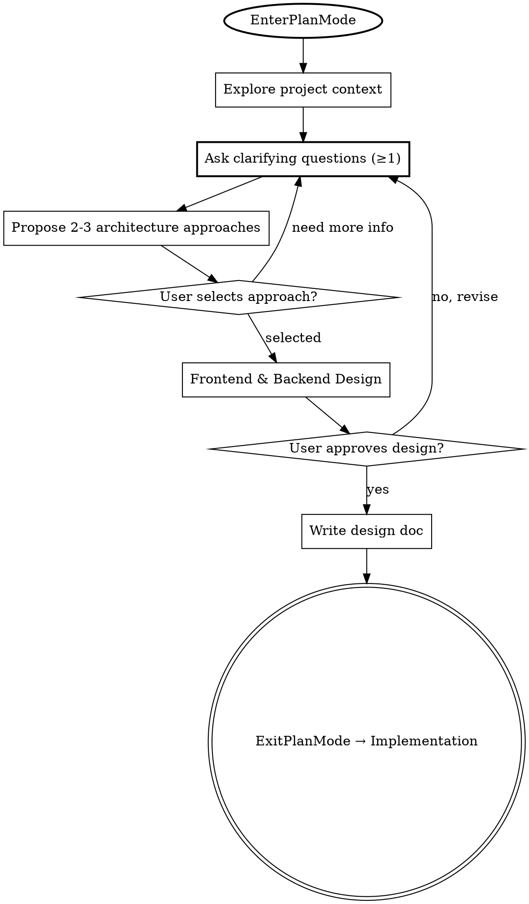

# PRD 解析与系统设计 (PRD to Design)

## ⛔ HARD CONSTRAINTS — 违反即失败

1. **禁止使用代码编辑工具**：在用户明确说出"批准设计"或"开始实现"之前，**严禁调用** `Edit`、`Write`、`NotebookEdit` 工具修改任何源代码文件（`.java`、`.js`、`.ts`、`.vue`、`.jsx`、`.tsx`、`.py`、`.go`、`.xml`、`.json`、`.yaml`、`.yml`、`.sql` 等）。唯一允许写入的文件是 `docs/designs/` 下的设计文档。
2. **禁止跳步**：必须严格按照 Checklist 的顺序执行，不得跳过任何一步。每一步完成后，必须在该步骤对应的 Task 上标记完成，然后才能开始下一步。
3. **必须使用 AskUserQuestion 工具**：需求澄清阶段必须至少向用户提出 1 个问题。不得自行假设用户意图。
4. **必须获得用户批准**：架构方案和前后端设计必须展示给用户并获得明确批准后，才能进入下一阶段。
5. **必须进入 Plan Mode**：调用此 Skill 后，第一个动作必须是调用 `EnterPlanMode`，在 Plan Mode 下完成所有探索和设计工作。
6. **必须参考设计指南**：在设计阶段，**必须**读取并遵循 `dst-design-guide` Skill 的内容

## Overview
将 PRD 中的业务想法转化为清晰的需求定义、严谨的架构决策以及完整的前后端开发设计。
从探索现有项目上下文开始，通过对话逐步澄清需求。在完全理解要构建的内容以及系统现状后，提出架构和前后端设计并获得用户的批准。

## Anti-Pattern: "需求很简单，直接开始写代码"
每个项目和 PRD 都必须经过这个过程。一个简单的 CRUD、一个单点功能追加或一个配置更改——所有这些看似"简单"的项目，往往是未经验证的假设导致最多无用功的地方。设计阶段可以很简短（对于真正简单的项目只需几句话），但你**必须**探索现状、澄清需求、明确前后端界限并获得批准。

## Checklist（严格顺序，不可跳过）
你**必须**为以下每一项创建一个 Task，并按严格顺序完成它们。每完成一步，标记该 Task 为 completed，再开始下一步：
1. **探索项目上下文** — 检查本地代码库（文件结构、现有文档、最近的 commits），理解当前系统的基建和约束。
2. **提出澄清问题** — 使用 `AskUserQuestion` 工具，每次一个问题，理解目标/约束/成功标准。**最少问 1 个问题**，直到你对需求有充分理解。
3. **提出 2-3 种架构方案** — 结合项目上下文和需求，提出方案并附带权衡分析与你的推荐。**必须等待用户选择或批准**。
4. **展示开发设计 (FE & BE)** — 严格区分前端与后端，分模块展示设计。**必须等待用户批准**。
5. **编写设计文档** — 将结论保存至 `docs/designs/YYYY-MM-DD-<topic>-design.md`。
6. **过渡到实现** — 用户批准设计文档后，方可退出 Plan Mode 并准备进入代码编写阶段。

## Process Flow

## The Process

### 1. 进入 Plan Mode
* 调用此 Skill 后的**第一个动作**必须是调用 `EnterPlanMode`。
* 在 Plan Mode 下，你只能使用 `Read`、`Glob`、`Grep`、`Agent`（Explore 类型）、`AskUserQuestion` 等只读/交互工具。

### 2. 探索项目上下文 (Exploring Project Context)
* **检查代码现状**：查看本地项目状态（如 `pom.xml`/`package.json`、核心目录结构、现有 `docs/`、最近的 `git log`）。
* **寻找复用点**：评估是否有现成的组件、API 规范或数据库表可以复用于新需求。
* 完成后标记对应 Task 为 completed。

### 3. 需求澄清 (Clarifying Requirements)
* **交叉验证**：将需求与步骤 2 中获取的本地代码上下文进行对比，找出冲突点（例如：需求要求的字段现有表里没有，或者前后端现有的鉴权机制不支持需求的要求）。
* **提问澄清**：使用 `AskUserQuestion` 工具提问以完善细节。
    * **每次仅限一个问题** — 如果一个主题需要更多探讨，请拆解为多个问题。
    * **首选选择题** — 尽可能提供 2-3 个基于你专业经验的选项供用户选择，开放式提问仅作为备选。
    * 重点关注：异常处理、边界条件、数据约束、状态机闭环。
    * **⛔ 最少问 1 个问题**。不得自行假设后直接跳到架构方案。
* 完成后标记对应 Task 为 completed。

### 4. 探索架构方案 (Exploring Approaches)
* 提出 2-3 种不同的架构或核心实现策略，并说明各自的 Trade-offs（开发成本、性能、可维护性等）。
* 以对话形式展示选项，把你推荐的方案放在第一位并说明原因。
* **⛔ 门控**：必须使用 `AskUserQuestion` 请用户选择方案，收到用户选择后才能继续。
* 完成后标记对应 Task 为 completed。

### 5. 前后端开发设计 (Frontend & Backend Design)
当你确认理解了需求并选定了架构后，必须严格**区分前后端**进行契约与模块设计。根据复杂程度缩放每个部分的篇幅（简单的几句话，复杂的 200-300 字）：
* **后端设计 (Backend)**：
    * **数据模型 (Data Model)**：表结构设计、核心字段、索引变更。
    * **API 契约 (API Contract)**：REST/GraphQL 接口定义、请求/响应结构、状态码。
    * **核心逻辑 (Core Logic)**：关键算法、并发处理、缓存策略等。
* **前端设计 (Frontend)**：
    * **视图与组件 (Views & Components)**：页面拆解、UI 结构、可复用组件。
    * **状态管理 (State Management)**：全局/局部状态流转、数据源订阅。
    * **交互逻辑 (Interactions)**：如何消费 API、Loading 状态、异常兜底呈现。
* **⛔ 门控**：展示设计后，必须使用 `AskUserQuestion` 请用户批准。收到"批准"后才能继续。
* 完成后标记对应 Task 为 completed。

### 6. 编写设计文档 & 过渡到实现
* 将最终确认的需求上下文、架构决策和前后端设计写入 `docs/designs/YYYY-MM-DD-<topic>-design.md`。
* 调用 `ExitPlanMode` 退出 Plan Mode，准备进入代码编写阶段。

## Key Principles
* **先看代码再看需求** — 上下文决定了架构的走向，永远不要在真空中设计。
* **每次一个问题** — 不要用十几个问题的信息轰炸用户。
* **选择题优先** — 相比于开放式的问答，提供选项更容易让用户做出决策。
* **坚决分离前后端** — 无论项目多小，前端的状态展示与后端的接口数据必须界限分明。
* **增量验证** — 提出设计，获得批准，然后再继续。如果方向错误，要灵活地返回澄清。
* **⛔ 绝不跳步** — 任何情况下都不得跳过需求澄清和设计审批直接编写代码。
